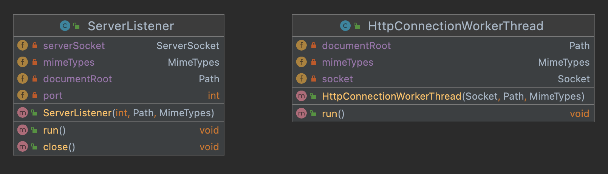
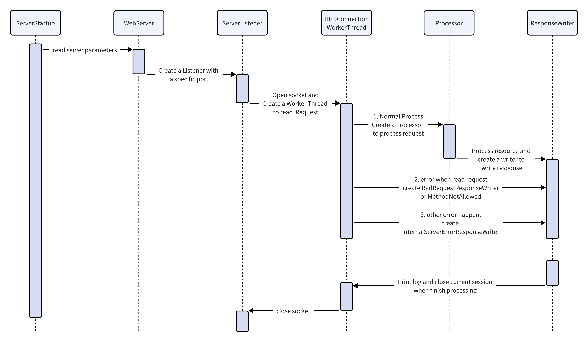

# Web Server Documentation

Group: Team CC

Author1: Xu Gu  (guxu11)

Author2: Ruxue Jin (RuxueJ)

## Results and Conclusions

### What I Learned

Through this assignment, we learned a lot about setting up and managing a web server. We found out that starting a server involves picking the right port number, document root, and MIME types to talk to clients effectively. Understanding how the ServerSocket class works helped us get the hang of connecting with clients. We also dived into HTTP request structures, which taught us how to handle different kinds of requests and send back the right responses. Following Test-Driven Development (TDD) methods helped us write our code more effectively, making sure it does what it's supposed to. And with Git rebase, we figured out how to work together on our code smoothly. Lastly, we learned to keep our code clean and organized by abstracting parts of it and storing constants in a dedicated place. Overall, this assignment was a great way to learn about building web servers and writing better code.

### Challenges I Encountered

We faced some tough tech challenges while trying to understand things like web servers, sockets, and MIME types. To help us get it, we watched YouTube videos and talked it over with our teammates. Figuring out how the process class works was also a bit of a struggle. We had to watch lectures, read assignment instructions, and really dig into the basecode. And when it came to designing a multi-threaded server, we found a helpful YouTube video to guide us <a href="https://www.youtube.com/watch?v=n3tDl1JsJiE&list=PLAuGQNR28pW56GigraPdiI0oKwcs8gglW&index=4" >. On the communication side, we realized that one teammate was better at programming and debugging than the other. But the good news is, the more experienced teammate was really patient and willing to help out. So, by working together and learning from each other, we managed to tackle these challenges. 

### System Design (Extra Credit - 5 pts)

Based on the original design, I added some Processors to process different HTTP methods. The `ProcessorFactory` will return a specific `Processor` by the HTTP method. The processors extend an abstract class `Processor`. Processors need to override `process()` method, which will return a specific `ResponseWriter` object according to the input.

Apart from that, I also created a core package including a `ServerListener` class and a `HttpConnectionWorkerThread` class. They both extend `Thread` class and they are created to process the multiple requests at the same time.

The interact is shown in the sequence figure below

