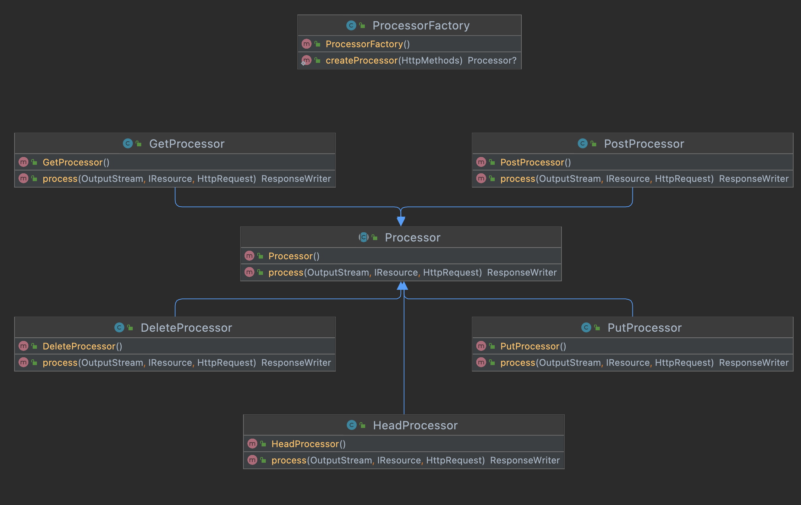

# Web Server Documentation

Group: Team CC

Author1: Xu Gu  (guxu11)

Author2: Ruxue Jin (RuxueJ)

## Results and Conclusions

### What I Learned

REPLACE THIS TEXT: Describe what you learned by completing this assignment. Aim for a paragraph.

### Challenges I Encountered

REPLACE THIS TEXT: Describe challenges you encountered completing this assignment, and how you overcame those challenges. Aim for a paragraph.

### System Design (Extra Credit - 5 pts)

REPLACE THIS TEXT: Tell me about the design of your system. What classes did you create, and why? How do they interact? How are they organized? (A class diagram is expected to be included; you may include separate class diagrams for each package to keep the diagram readable.)

Based on the original design, I added some Processors to process different HTTP methods. The `ProcessorFactory` will return a specific `Processor` by the HTTP method. The processors extend an abstract class `Processor`. Processors need to override `process()` method, which will return a specific `ResponseWriter` object according to the input.

Apart from that, I also created a core package including a `ServerListener` class and a `HttpConnectionWorkerThread` class. They both extend `Thread` class and they are created to process the multiple requests at the same time.

The interact is shown in the sequence figure below

